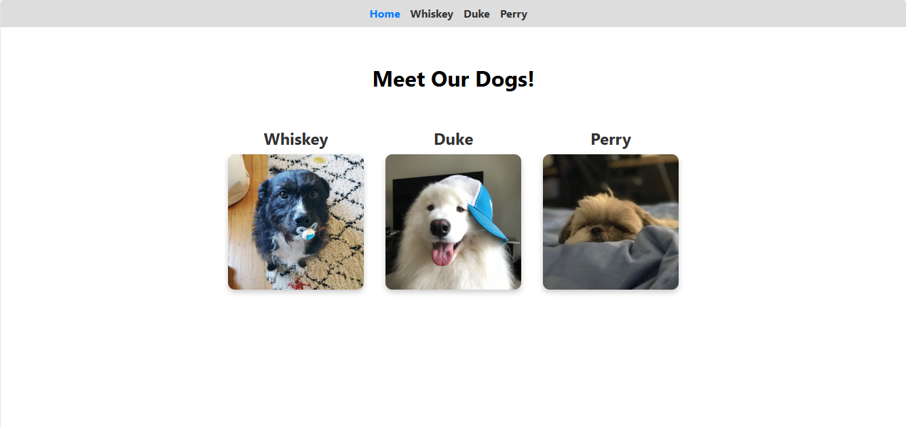
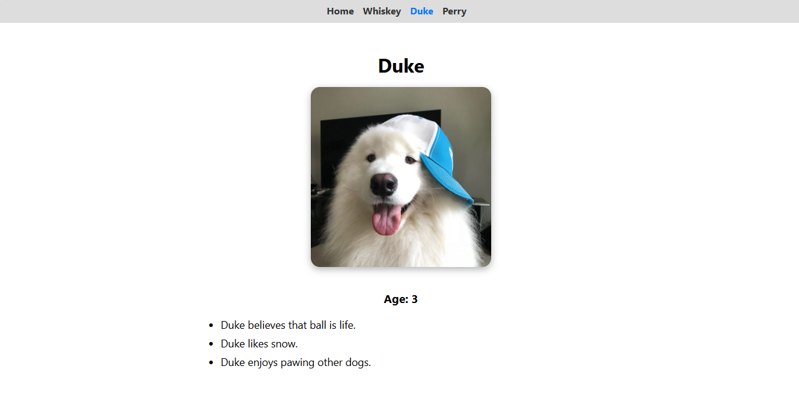
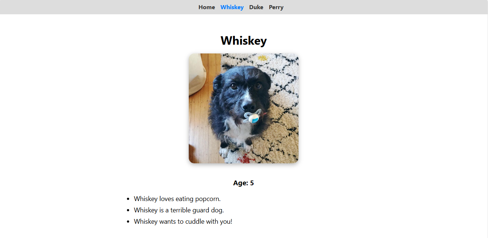
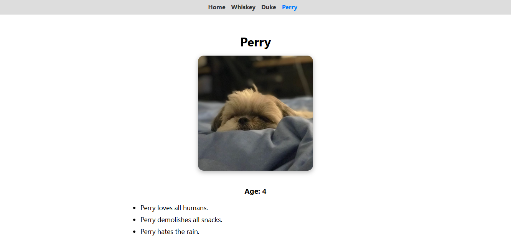

# 🐶 React Router Dog Finder

A fun React application that uses **React Router v6** to display information about various dogs. Users can view a homepage of all dogs and click on any dog to see detailed facts about them.

---

## 🚀 Features

- 🏠 Homepage at `/dogs` showing all dog profiles
- 🐾 Dynamic routing with URLs like `/dogs/duke`
- ❌ Catch-all 404 route for undefined paths
- 🔁 Redirect from `/` to `/dogs`
- 🔗 Navigation bar to quickly switch between dogs
- 🎨 Clean UI with individual pages and images

---

## 🧱 Tech Stack

- React
- React Router v6
- CSS
- Jest + React Testing Library (for unit tests)

---

## 📸 Screenshots

| Dog List Page              | Dog Details Page         |
|---------------------------|--------------------------|
|  |  |
|                           |  |
|                           |  |